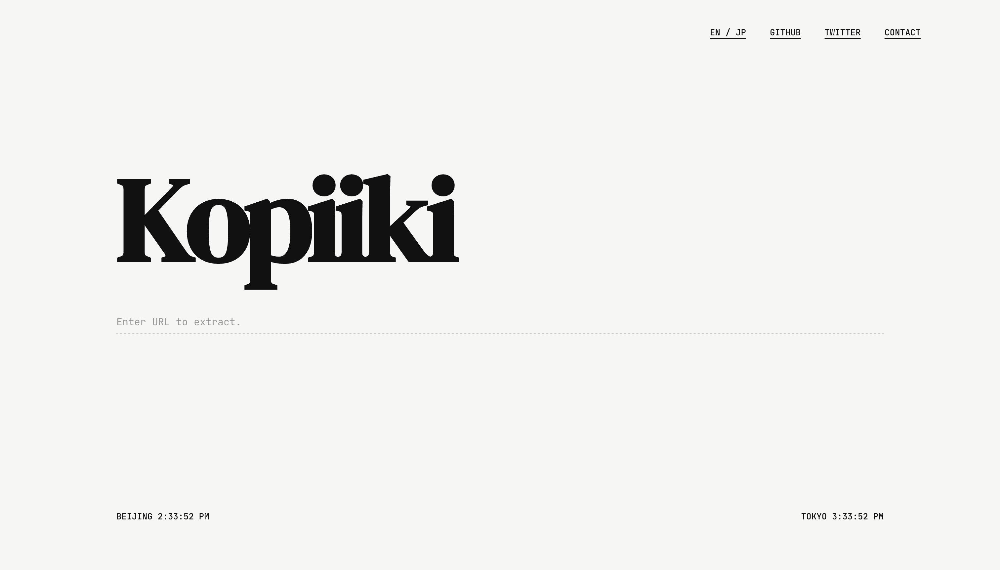

# Kopiiki

一个用于将网页快照提取并打包为自包含离线包的工具。

## 🚀 快速启动

执行项目根目录下的脚本即可自动完成环境配置和服务启动：

```bash
cd kopiiki
./start.sh
```

- **前端界面**: http://localhost:5176
- **后端服务**: http://localhost:5002

---

## ⚙️ 技术架构

项目采用前后端分离架构，通过异步任务流实现网页渲染与资源抓取：

```
[ 用户浏览器 ]
      │
[ 前端 (React) :5176 ] <─── 实时进度状态 (SSE) ───┐
      │                                       │
      └─── 提取请求 (POST) ───▶ [ 后端 (Flask) :5002 ]
                                     │
                                     └──▶ [ Playwright (Chromium) ]
                                               │
                                               └──▶ [ 目标网页 ]
```

- **前端**: 基于 React 处理交互逻辑与提取进度的视觉呈现。
- **后端**: Python 服务管理 Playwright 实例，负责高性能的网页渲染与静态资源递归解析。

---

## 🖥️ 前端操作指引

Kopiiki 提供了一个直观的操作界面，用户只需简单的步骤即可完成网页提取：

1. **输入 URL**: 在页面中心的输入框中输入您想要提取的目标网页地址。
2. **开始提取**: 点击输入框右侧的 **Enter (KeyReturn)** 图标或直接按下键盘回车键。
3. **实时监控**: 界面下方会显示实时的提取日志，您可以看到资源下载的具体情况。
4. **取消操作**: 在提取过程中，您可以点击右侧的 **停止 (StopCircle)** 图标随时中断提取任务。
5. **获取结果**: 提取完成后，系统会自动生成并触发下载一个包含完整网页资源的 ZIP 压缩包。



---

## ❤️ 鸣谢与法律声明

### 鸣谢
本工具的开发受到 [**WebTwin**](https://github.com/sirioberati/WebTwin) 项目的启发。感谢原作者在网页存档及自动化提取领域的开源工作。

### 法律免责声明
1. **用途限制**: Kopiiki 仅供个人备份、开发测试、学术研究及教育目的使用。
2. **合规义务**: 用户在使用本工具时，有义务确保其行为符合目标网站的 `robots.txt` 协议、服务条款以及相关国家/地区的版权法与知识产权法律。
3. **风险自担**: 用户应对其提取的内容及后续使用行为承担全部法律责任。开发者不对因使用本工具而导致的任何版权纠纷或法律风险承担任何责任。

---

[MIT License](LICENSE)
